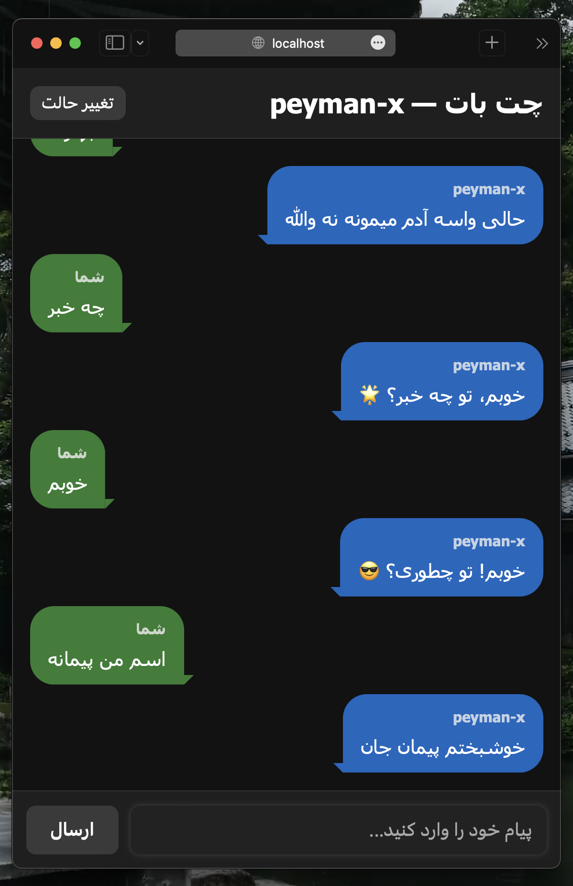
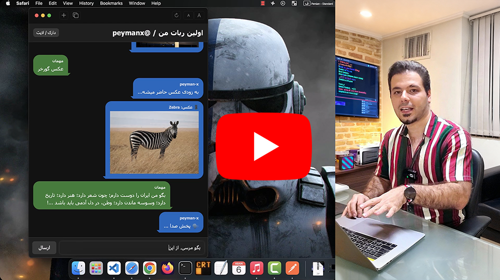

# 🚀 @peymanx Personal AI ChatBot  
Web-based conversational AI using **Node.js + RiveScript + ElevenLabs + Unsplash**


  
# [🤖 Try it online](https://peymanx-chatbot.onrender.com/)
 
This project is a complete web chatbot that runs on **Node.js + Express** (backend) and **HTML/CSS/JavaScript** (frontend).  
It supports natural conversation, translation, image search, text-to-speech, and theme switching.   

## Try RiveScript Online  
https://play.rivescript.com/   
https://peymanx-chatbot.onrender.com/


## ✨ Features

### 🧠 RiveScript Chat Engine
- Natural conversation
- Customizable replies via `brain/`
- Supports **Persian (fa)** and **English (en)**

### 🔊 ElevenLabs Text-to-Speech (TTS)
- Converts text into speech
- Streams audio (`mp3`) directly to the browser

### 🖼️ Unsplash Image Search
- Detects Persian input
- Auto-translates to English
- Fetches images from Unsplash
- Displays images inside chat

### 🎨 Dark/Light Theme
- Dynamic theme toggle  
- Controlled via RiveScript variables

### 🔁 Message History
- Navigate previous messages using ↑ / ↓ keys

---
## Screenshot  

---

## 📂 Project Structure

```

F:.
│   .gitignore
│   app.js
│   main.py
│   server.js
│   package.json
│   package-lock.json
│   README.md
│   shot.png
│
├───brain
│   ├───en
│   │       greating.rive
│   │       subs.rive
│   │
│   └───fa
│           greating.rive
│
└───public
│   index.html
│   core.js
│   style.css
│   get_image.html
│   tts.html

````

---

## 🛠 Installation & Setup

### 1️⃣ Install dependencies

```bash
npm install
````

### 2️⃣ Configure API Keys

#### Unsplash

In `public/core.js`:

```js
const api_key = "YOUR_UNSPLASH_ACCESS_KEY";
```

#### ElevenLabs

In `server.js`:

```js
apiKey: "YOUR_ELEVENLABS_API_KEY",
```

### 3️⃣ Run the server

```bash
node server.js
```

Your chatbot will be available at:

```
http://localhost:3000
```

---

## 📡 API Endpoints

### 🟦 POST /api/chat

Send message to RiveScript bot.

**Request body:**

```json
{
  "user": "Peyman Majidi",
  "message": "سلااااااام"
}
```

**Response:**

```json
{
  "reply": "چه با انرژی !!!",
  "vars": { "...user variables..." }
}
```

---

### 🟩 POST /tts

Convert given text to speech using ElevenLabs.

**Request body:**

```json
{
  "text": "Hello, world!"
}
```

**Returns:**
`audio/mpeg` stream (MP3)

---

## 🎯 Summary

This project provides a complete **personal AI assistant** with:

* Intelligent conversation
* Text-to-speech
* Image search
* Auto translation
* Theme switching
* RiveScript brain
* Modern frontend UI

## Related to this video
  

~~Not uploaded yet~~
